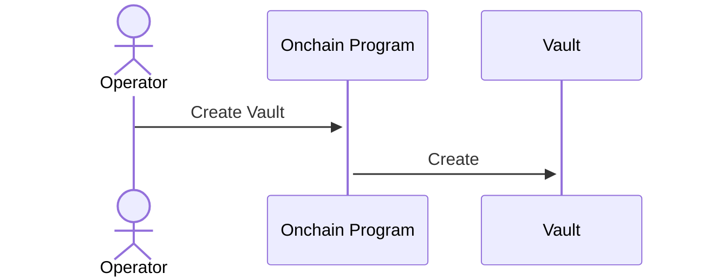
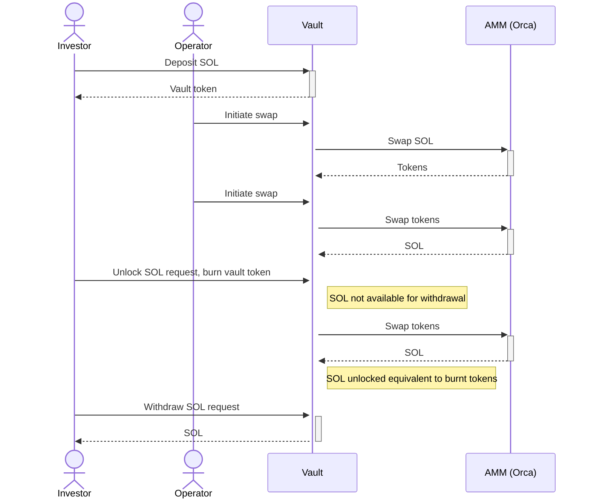
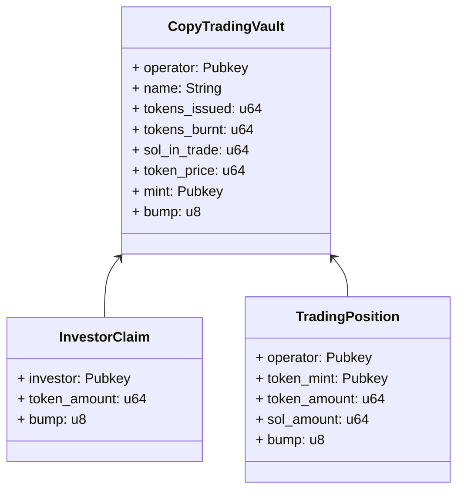
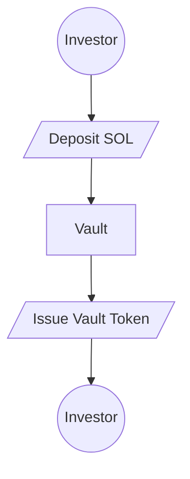
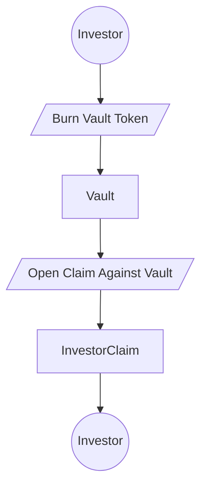
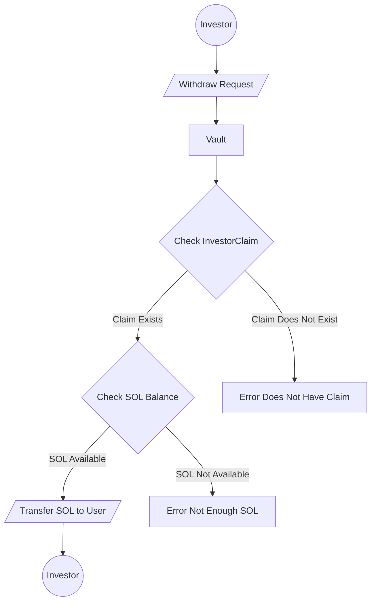
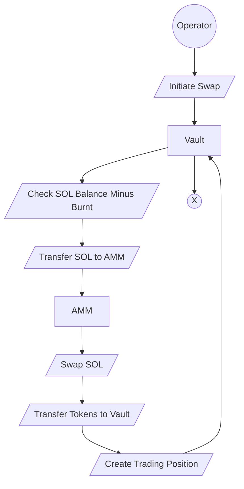
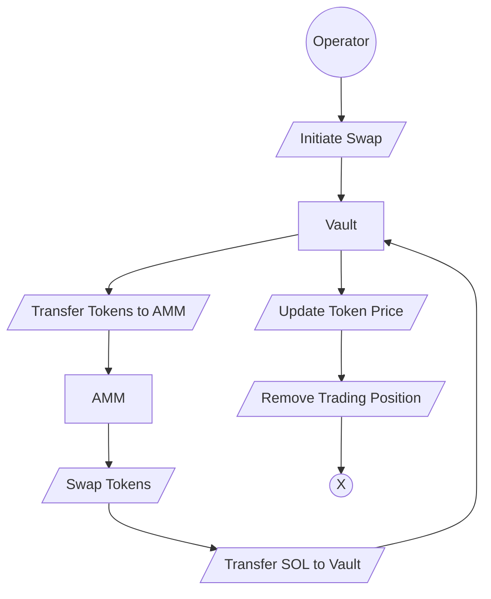

# Riseon Copy Trading Protol Requirements

The protocol is designed for two groups of users--operators and investors. 
- Operators are responsible for creating and managing the vault, and 
  executing trades on behalf of investors.
- Investors interact with the vault by depositing SOL and receiving vault tokens in return,
  or burning vault tokens and receiving SOL.

## Protocol POC Requirements

1. Protocol shall allow investors to deposit SOL
2. Protocol shall issue vault tokens to investors
3. Protocol shall allow vault operators to swap SOL any other token
4. Protocol shall allow vault operators to swap tokens to SOL
5. Protocol shall keep a record of changes to SOL balance
6. Protocol shall keep an accurate record of the token price
7. Protocol shall allow investors to initiate withdrawal of SOL by burning vault tokens
8. Protocol shall allow investors to withdraw SOL when SOL is available

The POC is currently not tracking fees for the vault operator. 
This is expected to be developed at a later stage.

## Operator Sequence Diagrams

1. Operator sends an instruction to the on-chain program to create a vault.
2. The on-chain program creates the vault and returns the vault address to the operator.

## Investor Sequence Diagrams

1. The investor deposits SOL into the vault.
2. The vault issues vault tokens to the investor.
3. The operator initiates a swap of SOL for another token.
4. The vault sends the SOL to the AMM for swapping.
5. The AMM returns the swapped tokens to the vault.
6. The operator initiates a swap of the tokens back to SOL.
7. The vault sends the tokens to the AMM for swapping.
8. The AMM returns the swapped SOL to the vault.
9. The investor requests to unlock SOL by burning the vault tokens.
10. The vault creates a claim for the investor.
11. When SOL is available investors can redeem the claim and withdraw the SOL.
12. The token price tracks gains and losses of the vault, 
    i.e. how much SOL the vault owes the investor.

## Account Overview

### CopyTradingVault (PDA)

The account `CopyTradingVault` is the main account for the protocol. 
Ideally, the vault will not be owned by either the operator or the investor, 
to prevent drainage of SOL.

- `operator`: is the operator of the vault
- `name`: is the name of the vault
- `tokens_issued`: is the token supply issued to investors in circulation
- `tokens_burnt`: is the amount of tokens burnt **BUT NOT YET WITHDRAWN**
- `sol_in_trade`: is the amount of SOL the vault has placed in a trade at the moment
- `token_price`: is the price of the token in SOL
- `mint`: is the mint address of the vault token
- `bump`: unique identifier made of **operator pubkey** and **name**

### TradingPosition (PDA)

The `TradingPosition` account is used to track trading positions that the operator takes.
- `operator`: is the operator of the vault
- `token_mint`: is the mint address of the token being traded
- `token_amount`: is the amount of tokens received in a trade
- `sol_amount`: is the amount of SOL placed in a trade
- `bump`: unique identifier made of **operator pubkey**, **vault address** and **token mint address**

### InvestorClaim (PDA)
The account `InvestorClaim` is used to keep track of the amount of SOL vault owes investor after the investor burns his tokens.

- `investor`: is the user who has a claim on the vault
- `sol_amount`: is the amount of SOL the investor has a claim on
- `bump`: unique identifier made of **investor pubkey** and **vault address**

### AMM

At the moment we are considering using Orca as AMM for swapping tokens, because the CPI
seems simpler to use.

## Deposit Flowcharts

- The investor deposits SOL into the vault.
- The vault issues vault tokens to the investor based on current token price

## Withdraw Flowcharts

- The investor burns the vault tokens to open a claim against the vault.
- The vault creates a claim for the investor in the `InvestorClaim` PDA.
- The claim is created with the amount of SOL the vault owes the investor **denoted in 
  vault tokens**. This is important because the price can change after an operator swaps tokens.

### When SOL is available

- The investor requests to withdraw SOL.
- The vault checks if the investor has a claim.
- If the claim exists, the vault checks if there is enough SOL available to withdraw.
- If there is enough SOL, the vault transfers the SOL to the investor.
- If there is not enough SOL, the vault returns an error.
- If the claim does not exist, the vault returns an error.
- The claim is closed after the investor withdraws the SOL.

## Swap

### SOL to token swap

- The operator initiates a swap of SOL for another token.
- The vault checks if there is enough SOL available to swap.
- The vault sends the SOL to the AMM for swapping.
- The vault creates a trading position for the operator.
- The AMM returns the swapped tokens to the vault.

### Token to SOL swap

- The operator initiates a swap of tokens for SOL.
- The vault sends the tokens to the AMM for swapping.
- The AMM returns the swapped SOL to the vault.
- The vault updates the token price based on the amount of SOL exchanged.
- The vault removes the trading position for the operator.

### Token Price Calculation

Token price is calculated using a linear equation based on the amount of SOL issued, 
and vault gains and losses. The token price is only calculated when 
operator exits a position to the native SOL token.

The equation under consideration at the moment looks like this: 

Yt​=Y0​+βS0​Y0​​(St​−S0​)

Where Y is the token price, Y0 is the initial token price,
S0 is the initial SOL amount, St is the current SOL amount,
and β is the gain/loss factor.

